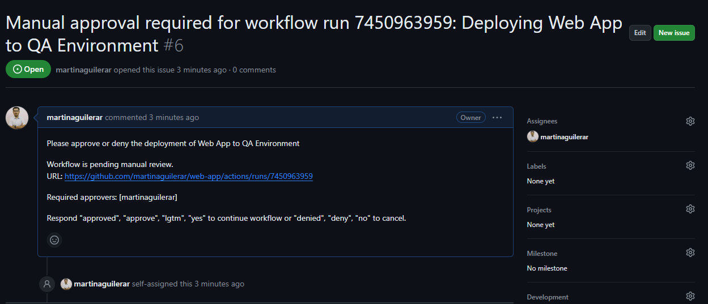

# Infrastructure and Application Deployment Guide

## Table of Contents
1. [Overview](#overview)
2. [Deployment urls](#deployment-urls)
3. [GitHub Actions Workflows](#github-actions-workflows)
    - [Dev Environment Workflow](#dev-environment-workflow)
    - [QA Environment Workflow](#qa-environment-workflow)
4. [Infrastructure Deployment](#infrastructure-deployment)
    - [Manual Approval](#application-deployment-workflows)
5. [Application Deployment](#application-deployment)
    - [Workflows](#application-deployment-workflows)
6. [Secrets](#secrets)
7. [Future Improvements](#secrets)

## Overview
This guide provides detailed instructions for deploying a simple NodeJS web app with Express to different environments (Dev and QA) using GitHub Actions and Terraform. The repository follows a specific structure to organize code and configurations efficiently.

## Deployment urls
- [DEV](https://mywebapp-maar-dev59c0.azurewebsites.net/)
- [QA](https://mywebapp-maar-qa.azurewebsites.net/)
- [PROD](https://mywebapp-maar-prod.azurewebsites.net/)

## GitHub Actions Workflows

### Dev Environment Workflow
Filename: [.github/workflows/dev-infra.yaml](./.github/workflows/dev-infra.yaml)

### QA Environment Workflow
Filename: [.github/workflows/qa-infra.yaml](./.github/workflows/qa-infra.yaml)

### PROD Environment Workflow
Filename: [.github/workflows/prod-infra.yaml](./.github/workflows/prod-infra.yaml)

## Infrastructure Deployment
The Terraform configurations in the terraform directory define Azure resources such as Storage Accounts, Web Apps, and Key Vaults. Each environment (Dev, QA, Prod) has its own set of configurations. These are the steps to deploy a change to the infrastructure:
1. Create a new branch and push a commit with the changes to the Terraform files inside the corresponding environment directory.
2. Create a pull request with the changes.
3. Once the pull request is created, the workflow will identify which files were modified and, depending on that, will run any of the Github Actions workflow. For the pull request only the Terraform Plan steps will run, no apply, no matter which environment. Once the Terraform Plan is finished, the output will be published as a comment in the pull request.
4. Get the necessary approvals for your pull request and, if everything looks good, merge it to main.
5. Once the pull request is merged, the workflow will run again but this time the Terraform apply for environments QA and PROD will ask for manual approval. After the approval, the deployment will run.

### Manual approvals
For deployment to QA and PROD, there will be a manual approval needed for terraform-apply and app-deployment jobs. Once the approval is needed, a new issue will be created (a similar example can be seen in the next image), respond "approved", "approve", "lgtm", "yes" to continue workflow or "denied", "deny", "no" to cancel. After the answer is provided, the issue will close itself.

## Application Deployment
The application consists of a simple NodeJS web app inside index.js. For the application deployment, the process is very similar to the infrastructure deployment:

1. Create a new branch and push a commit with the changes to the NodeJS files.
2. Create a pull request with the changes.
3. Once the pull request is created, the workflow will identify which files were modified and, depending on that, will run any of the Github Actions workflow. For the pull request only NodeJS Build steps will run, no web app deployment, no matter which environment.
4. Get the necessary approvals for your pull request and. If everything looks good, merge it to main.
5. Once the pull request is merged, the workflow will run again but this time the Application Deployment for environments QA and PROD will ask for manual approval. After the approval, the deployment will run.

### Application Deployment Workflows
1. Build NodeJS App:
- GitHub Actions Workflow: build-app
- Action: Sets up Node.js, installs dependencies, builds the application and uploads the artifact.

2. Deploy to Azure Web App:
- GitHub Actions Workflow: deploy-app
- Action: Downloads the artifact from the build job and deploys it to the Azure Web App.

## Secrets
GitHub Actions workflows use secrets for sensitive information. The following secrets are configured in the GitHub repository:

- TF_VAR_AZURE_CLIENT_ID
- TF_VAR_AZURE_SUBSCRIPTION_ID
- TF_VAR_AZURE_TENANT_ID
- TF_VAR_AZURE_CLIENT_SECRET
- AZURE_WEBAPP_PUBLISH_PROFILE_DEV
- AZURE_WEBAPP_PUBLISH_PROFILE_QA

## Future Improvements
Since this was just a short practical exercise, there's a lot to improve for the whole project if this were a production project and there was more time for deployment:

1. Modify the app build in order to use containers and create a Container Registry that saves all the different versions created. The current approach with upload/downloading the artifact on Github takes a lot of time.
2. Create a resource group for each environment instead of having everything in a single resource group.
3. Use variables for each environment instead of having everything static.
4. Divide the web app and infrastructure files into two different repositories, each with its own workflows.
5. Configure another type of manual approval which is simpler. The current one may cause a lot of issues to open/close. Or better, make it all automatic based on tests, monitoring alerts and performance checks.